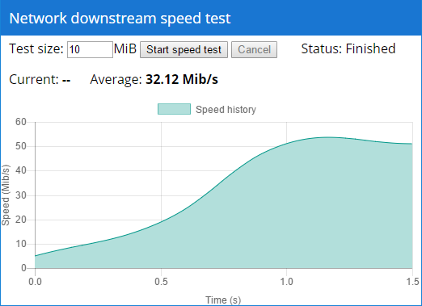

Network downstream speed test
=============================

Requirements
------------
- Any web server
- HTML Browsers with support HTML5 canvas, CSS flexbox
- PHP (recomended, but not neccesary)

Installation
------------
Copy whole `src` directory to anywhere to your webserver.

If server has no PHP, you have to rewrite `random-data.php` by any random data.
 This file is used as testing data. It is recomended to have 10-50MiB file size.

 
Licence
-------
[CC BY-SA](https://creativecommons.org/licenses/by-sa/2.0/)
